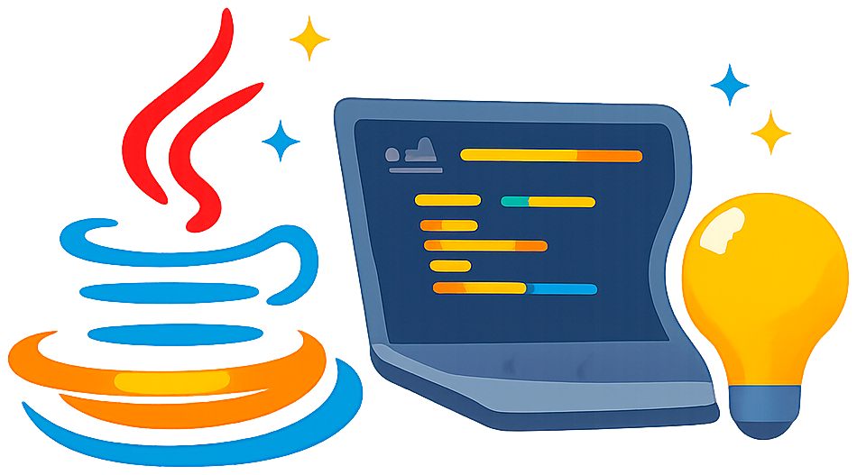

# Java Projects Showcase

<p align="center">
  
</p>


### Portafolio profesional de proyectos Java

Collection of Java projects 


  


   

#### **Estado del Proyecto**

  

####  **Tabla de Contenidos**

- [ Características](#características)
- [ Proyectos](#proyectos)
- [ Cómo Empezar](#cómo-empezar)
- [ Contacto](#contacto)

####  **Características**
✅ Proyectos organizados por nivel de complejidad  
✅ Código documentado y con comentarios  
✅ Pruebas unitarias implementadas  
✅ Configuración CI/CD automatizada  
✅ Dockerización de aplicaciones  

###  **Proyectos**


<details>
<summary><strong>🟢 Nivel Avanzado</strong></summary>

| Proyecto | Descripción | Tecnologías | Estado |
|----------|-------------|-------------|--------|

</details>

<details>
<summary><strong>🟡 Nivel Intermedio</strong></summary>

| Proyecto | Descripción | Tecnologías | Estado |
|----------|-------------|-------------|--------|

</details>

<details>
<summary><strong>🔵 Nivel Básico</strong></summary>

| Proyecto | Descripción | Tecnologías |
|----------|-------------|-------------|
| [Hello World](proyectos/nivel-basico/1.hello-world) | Primer programa en Java | Java 17, Maven |
| [Converter](proyectos/nivel-basico/2.converter) | Conversor de unidades básico | Java 17, Maven |


</details>

# Navegar a un proyecto específico
```text
cd proyectos/api-rest
```

# Compilar y ejecutar
```bash
mvn clean install
mvn spring-boot:run
```

